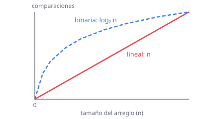

# Búsqueda binaria

Sobre un arreglo **ordenado**, la búsqueda binaria descarta la mitad del
espacio de búsqueda en cada paso. Esta página usa `presentation: explicit`:
solo el contenido marcado forma parte del deck.

<Slide title="La idea">
  Comparamos el objetivo con el elemento del medio: si es menor, seguimos en la
  mitad izquierda; si es mayor, en la derecha. Repetimos hasta encontrarlo o
  quedarnos sin elementos.
</Slide>

<Slide title="Implementación">
```java
int busquedaBinaria(int[] a, int objetivo) {
  int lo = 0, hi = a.length - 1;
  while (lo <= hi) {
    int medio = lo + (hi - lo) / 2;
    if (a[medio] == objetivo) return medio;
    if (a[medio] < objetivo) lo = medio + 1;
    else hi = medio - 1;
  }
  return -1;
}
```
</Slide>

## Costo

Cada iteración reduce el rango a la mitad: sobre $$n$$ elementos hay a lo más

$$
\lfloor \log_2 n \rfloor + 1
$$

iteraciones. Esta sección es prosa de libro: al no estar marcada, no aparece en
el deck. Contrasta con [[intro-estructuras|la introducción]].


