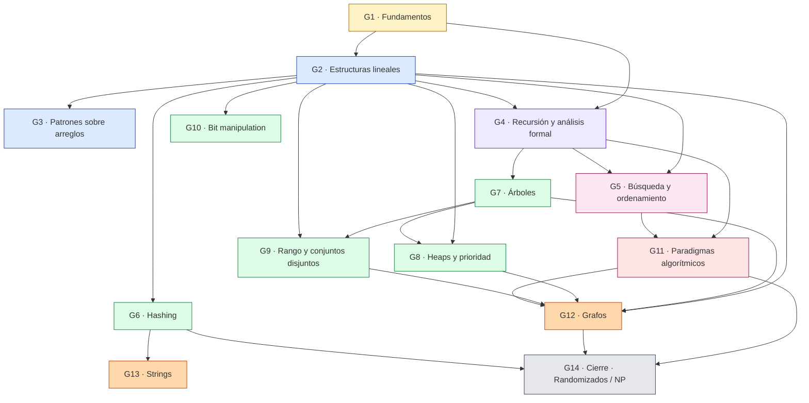

# Grafo de dependencias del curso

Mapa del temario del curso de Estructuras de Datos y Algoritmos.
Las flechas se leen **"de prerrequisito a dependiente"**: si `A → B`, entonces
para enseñar `B` los estudiantes ya tienen que dominar `A`.

Este archivo es la **fuente de verdad** del temario. Cuando se mueva o se
agregue un tópico, se edita aquí.

**Lo que no aparece acá:** la unidad _Java para quien viene de C++_
(`content/courses/sample-course/`, WPs #76–#81) es un repaso del lenguaje previo
al temario, no un tópico de EDA. No tiene nodo en el grafo ni fila en la tabla
porque no es prerrequisito de ninguno de los 51 tópicos: es prerrequisito del
curso entero. Si algún día una unidad de lenguaje sí condiciona un tópico
concreto, ahí sí entra al grafo.

---

## 1. Grafo macro (14 grupos)

Vista de pájaro: cómo se encadenan los grandes bloques del curso.

---

## 2. Grafo detallado (todos los tópicos)

Cada nodo es un sub-tópico enseñable. Esta es la vista que se usa para
ordenar clases y decidir cuándo introducir cada concepto.

```mermaid
graph TD
    %% G1 · Fundamentos
    intro[Intro & TDAs]
    bigO[Complejidad Big O/Ω/Θ]

    %% G2 · Estructuras lineales
    arr[Arreglos estáticos/dinámicos]
    ll[Listas enlazadas]
    stack[Pilas]
    queue[Colas / Deques]

    %% G3 · Patrones sobre arreglos
    twoP[Dos punteros]
    slide[Sliding window]
    prefix[Prefix sums]

    %% G4 · Recursión y análisis formal
    rec[Recursión]
    recur[Recurrencias / Master Theorem]
    amort[Análisis amortizado]

    %% G5 · Búsqueda y ordenamiento
    linSearch[Búsqueda lineal]
    binSearch[Búsqueda binaria]
    s2[Sorts O n²: bubble/selection/insertion]
    dc[Divide y vencerás]
    mq[Merge sort / Quicksort]
    sortLin[Sorts lineales: counting/radix/bucket]

    %% G6 · Hashing
    hash[Tablas hash]
    hashFn[Funciones hash]
    bloom[Bloom filters]
    skip[Skip lists]

    %% G7 · Árboles
    tree[Árboles binarios + recorridos]
    bst[BST]
    avl[AVL]
    rb[Red-Black]
    btree[B-trees / B+ trees]
    trie[Tries]

    %% G8 · Heaps
    heap[Heap binario]
    pq[Priority queue]
    hsort[Heap-sort]

    %% G9 · Rango y conjuntos disjuntos
    seg[Segment trees]
    fen[Fenwick / BIT]
    uf[Union-Find]

    %% G10 · Bit manipulation
    bit[Bit manipulation]

    %% G11 · Paradigmas
    bt[Backtracking]
    greedy[Greedy]
    dp[Dynamic Programming]

    %% G12 · Grafos
    gr[Representación de grafos]
    bfs[BFS]
    dfs[DFS]
    topo[Orden topológico]
    scc[SCC: Tarjan/Kosaraju]
    dij[Dijkstra]
    bf[Bellman-Ford]
    fw[Floyd-Warshall]
    prim[Prim]
    krus[Kruskal]
    flow[Max flow / Min cut]

    %% G13 · Strings
    kmp[KMP]
    rk[Rabin-Karp]
    za[Z-algorithm]
    sa[Suffix arrays]

    %% G14 · Cierre
    rand[Randomizados]
    np[P, NP, NP-completo]

    %% Aristas
    intro --> bigO
    bigO --> arr
    bigO --> s2
    bigO --> binSearch
    bigO --> recur

    arr --> ll
    arr --> stack
    arr --> queue
    arr --> twoP
    arr --> slide
    arr --> prefix
    arr --> linSearch
    arr --> binSearch
    arr --> s2
    arr --> hash
    arr --> heap
    arr --> bit
    arr --> fen
    arr --> uf
    arr --> gr
    arr --> amort

    ll --> stack
    ll --> queue
    ll --> hash
    ll --> skip
    ll --> gr

    stack --> rec
    rec --> recur
    rec --> tree
    rec --> dc
    rec --> bt
    rec --> dp
    rec --> dfs
    rec --> seg
    rec --> za

    recur --> dc
    recur --> dp

    dc --> mq
    s2 --> mq
    mq --> sortLin
    mq --> krus
    mq --> sa
    mq --> rand

    binSearch --> bst

    tree --> bst
    tree --> heap
    tree --> trie
    tree --> seg
    tree --> uf

    bst --> avl
    avl --> rb
    rb --> btree

    heap --> pq
    heap --> hsort
    s2 --> hsort

    hash --> hashFn
    hashFn --> bloom
    hash --> rk
    hash --> rand

    stack --> bt
    queue --> bfs

    s2 --> greedy
    pq --> greedy

    gr --> bfs
    gr --> dfs
    gr --> dij
    gr --> bf
    gr --> fw
    gr --> prim
    gr --> krus
    gr --> flow

    dfs --> topo
    dfs --> scc
    topo --> scc

    pq --> dij
    greedy --> dij

    dp --> bf
    dp --> fw

    pq --> prim
    greedy --> prim

    uf --> krus
    greedy --> krus

    bfs --> flow

    trie --> kmp
    dp --> kmp

    dp --> np
    greedy --> np
    flow --> np
```

---

## 3. Orden de enseñanza propuesto (topological sort)

Esta es **una** secuencia válida que respeta todas las dependencias del grafo.
No es la única posible — sirve como punto de partida para el calendario.

| #   | Tópico                                      | Grupo | Depende de     |
| --- | ------------------------------------------- | ----- | -------------- |
| 1   | Intro & TDAs                                | G1    | —              |
| 2   | Complejidad Big O / Ω / Θ                   | G1    | 1              |
| 3   | Arreglos estáticos y dinámicos              | G2    | 2              |
| 4   | Listas enlazadas                            | G2    | 3              |
| 5   | Pilas                                       | G2    | 3, 4           |
| 6   | Colas / Deques                              | G2    | 3, 4           |
| 7   | Dos punteros · sliding window · prefix sums | G3    | 3              |
| 8   | Búsqueda lineal y binaria                   | G5    | 3              |
| 9   | Sorts O(n²)                                 | G5    | 3              |
| 10  | Recursión                                   | G4    | 5              |
| 11  | Recurrencias + Master Theorem               | G4    | 2, 10          |
| 12  | Análisis amortizado                         | G4    | 3              |
| 13  | Divide y vencerás                           | G5    | 10, 11         |
| 14  | Merge sort / Quicksort                      | G5    | 9, 13          |
| 15  | Sorts lineales (counting/radix/bucket)      | G5    | 14             |
| 16  | Bit manipulation                            | G10   | 3              |
| 17  | Tablas hash + funciones hash                | G6    | 3, 4           |
| 18  | Bloom filters                               | G6    | 17             |
| 19  | Skip lists                                  | G6    | 4              |
| 20  | Árboles binarios + recorridos               | G7    | 10             |
| 21  | BST                                         | G7    | 8, 20          |
| 22  | AVL                                         | G7    | 21             |
| 23  | Red-Black trees                             | G7    | 22             |
| 24  | B-trees / B+ trees                          | G7    | 23             |
| 25  | Tries                                       | G7    | 20             |
| 26  | Heap binario                                | G8    | 3, 20          |
| 27  | Priority queue                              | G8    | 26             |
| 28  | Heap-sort                                   | G8    | 9, 26          |
| 29  | Segment trees                               | G9    | 10, 20         |
| 30  | Fenwick / BIT                               | G9    | 3, 16          |
| 31  | Union-Find                                  | G9    | 3, 20          |
| 32  | Backtracking                                | G11   | 5, 10          |
| 33  | Greedy                                      | G11   | 9, 27          |
| 34  | Dynamic programming                         | G11   | 10, 11         |
| 35  | Representación de grafos                    | G12   | 3, 4           |
| 36  | BFS                                         | G12   | 6, 35          |
| 37  | DFS                                         | G12   | 5, 10, 35      |
| 38  | Orden topológico                            | G12   | 37             |
| 39  | SCC (Tarjan / Kosaraju)                     | G12   | 37, 38         |
| 40  | Dijkstra                                    | G12   | 27, 33, 35     |
| 41  | Bellman-Ford                                | G12   | 34, 35         |
| 42  | Floyd-Warshall                              | G12   | 34, 35         |
| 43  | Prim                                        | G12   | 27, 33, 35     |
| 44  | Kruskal                                     | G12   | 14, 31, 33, 35 |
| 45  | Max flow / Min cut                          | G12   | 36             |
| 46  | KMP                                         | G13   | 25, 34         |
| 47  | Rabin-Karp                                  | G13   | 17             |
| 48  | Z-algorithm                                 | G13   | 10             |
| 49  | Suffix arrays                               | G13   | 14             |
| 50  | Algoritmos randomizados                     | G14   | 14, 17         |
| 51  | P, NP, NP-completo                          | G14   | 33, 34, 45     |

---

## 4. Cómo iterar este documento

- **Mover un tópico** → editar el orden de la tabla y verificar que sus
  dependencias todavía aparezcan antes.
- **Agregar un tópico** → agregar un nodo al grafo detallado, conectar sus
  prerrequisitos, agregar fila a la tabla.
- **Eliminar un tópico** → revisar que ningún otro nodo lo tuviera como
  prerrequisito (si lo tiene, hay que reconectar al prerrequisito anterior).
- **Cuando el grafo crezca a +80 nodos** y la legibilidad de Mermaid se
  rompa, partir el grafo detallado por bloques (un sub-grafo por fase) o
  migrar a Graphviz/DOT.
